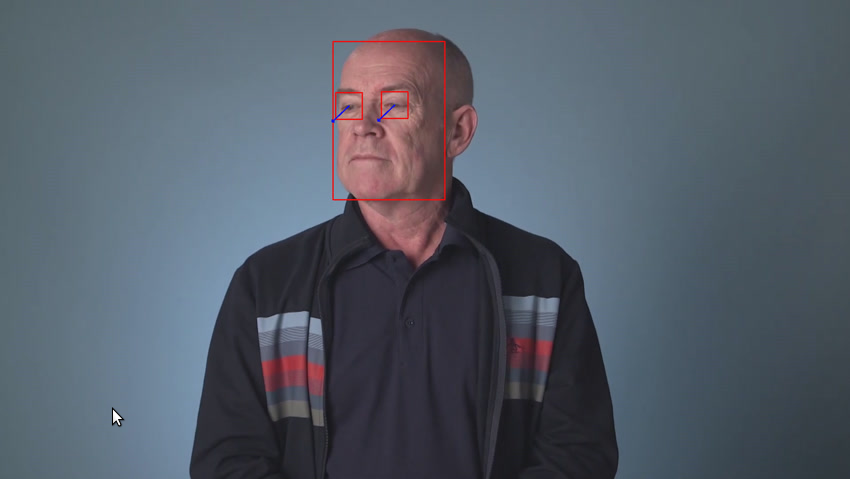

# Computer Pointer Controller

Project is an example of usage of OpenVINO™ Toolkit to execute inference pipeine to analyze eye gaze direction and move computer poiner accordingly. Models in pipeline:

- [Face Detection Model](https://docs.openvinotoolkit.org/latest/_models_intel_face_detection_adas_binary_0001_description_face_detection_adas_binary_0001.html)
- [Face Landmarks Detection Model](https://docs.openvinotoolkit.org/latest/_models_intel_landmarks_regression_retail_0009_description_landmarks_regression_retail_0009.html)
- [Head Pose Estimation Model](https://docs.openvinotoolkit.org/latest/_models_intel_head_pose_estimation_adas_0001_description_head_pose_estimation_adas_0001.html)
- [Gaze Estimation](https://docs.openvinotoolkit.org/latest/_models_intel_gaze_estimation_adas_0002_description_gaze_estimation_adas_0002.html)


## Project Set Up and Installation

### OpenVINO™

Install [OpenVINO™ Toolkit](https://docs.openvinotoolkit.org/latest/)

### Downloading models

```
python3 /opt/intel/openvino/deployment_tools/tools/model_downloader/downloader.py --name face-detection-adas-binary-0001 --output_dir 'nd131-computer-pointer-controller/models'

python3 /opt/intel/openvino/deployment_tools/tools/model_downloader/downloader.py --name head-pose-estimation-adas-0001 --output_dir 'nd131-computer-pointer-controller/models'

python3 /opt/intel/openvino/deployment_tools/tools/model_downloader/downloader.py --name landmarks-regression-retail-0009 --output_dir 'nd131-computer-pointer-controller/models'

python3 /opt/intel/openvino/deployment_tools/tools/model_downloader/downloader.py --name gaze-estimation-adas-0002 --output_dir '/nd131-computer-pointer-controller/models'
```

### Activate virtualenv and install dependencies

```
virtualenv nd131-computer-pointer-controller
source nd131-computer-pointer-controller/bin/activate
python3 -m pip install -r requirements.txt
```

## Demo



### Run ffmpeg to monitor output

```
sudo ffserver -f ./ffmpeg/server.conf
```

### Run app and redirect stout to ffmpeg server

```python

python3 src/main.py --model_face_detection models/intel/face-detection-adas-binary-0001/FP32-INT1/face-detection-adas-binary-0001 \
                    --model_facial_landmarks models/intel/landmarks-regression-retail-0009/FP32/landmarks-regression-retail-0009 \
                    --model_head_pose_estimation models/intel/head-pose-estimation-adas-0001/FP32/head-pose-estimation-adas-0001 \
                    --model_gaze_estimation models/intel/gaze-estimation-adas-0002/FP32/gaze-estimation-adas-0002 \
                    --device CPU \
                    --threshold 0.5 \
                    --visualize True \
                    --cursor_precision low \
                    --cursor_speed fast \
                    --video bin/demo.mp4 \
                    --stream true \
| ffmpeg \
  -v warning \
  -f rawvideo \
  -pixel_format bgr24 \
  -video_size 1920*1080 \
  -framerate 24 \
  -i - http://0.0.0.0:3004/fac.ffm

```

### Run wth camera

```python

python3 src/main.py --model_face_detection models/intel/face-detection-adas-binary-0001/FP32-INT1/face-detection-adas-binary-0001 \
                    --model_facial_landmarks models/intel/landmarks-regression-retail-0009/FP32/landmarks-regression-retail-0009 \
                    --model_head_pose_estimation models/intel/head-pose-estimation-adas-0001/FP32/head-pose-estimation-adas-0001 \
                    --model_gaze_estimation models/intel/gaze-estimation-adas-0002/FP32/gaze-estimation-adas-0002 \
                    --device CPU \
                    --threshold 0.5 \
                    --visualize True \
                    --cursor_precision low \
                    --cursor_speed fast \
                    --video cam \
                    --stream true \
| ffmpeg \
  -v warning \
  -f rawvideo \
  -pixel_format bgr24 \
  -video_size 640*480 \
  -framerate 24 \
  -i - http://0.0.0.0:3004/fac.ffm

```

### Get output video

- [http://localhost:3004/facstream.mjpeg](http://localhost:3004/facstream.mjpeg)
- [ouptput.mp4]()

## Documentation

### Command line arguments

| Parameter                    | Default value | Meaning                                               |
| ---------------------------- | ------------- | ----------------------------------------------------- |
| --model_face_detection       |               | Path to Face detection model                          |
| --model_facial_landmarks     |               | Path to Facial landmarks detection model              |
| --model_head_pose_estimation |               | Path to Head pose estimation model                    |
| --model_gaze_estimation      |               | Path to Gaze estimation model                         |
| --device                     | CPU           | Device to use as inference acceleratir                |
| --video                      |               | Path to video file (or "cam" to use web camera input) |
| --threshold                  | 0.5           | Preceision threshols                                  |
| --extensions                 |               | OpenVINI extension to load                            |
| --stream                     | False         | Stream output frames to stdout                        |
| --out                        |               | Output file path                                      |
| --cursor_precision           | medium        | Cursor movement precision                             |
| --cursor_speed               | medium        | Cursor movement speed                                 |
| --visualize                  | False         | Visualize output of intermidiate models               |

## Benchmarks

Model with the lower precision (INT8) gives the best performance results. However, the most expensive inference is face detection (where the full sized frame is analyzed). Unfortunately, `face-detection-adas-binary-0001` is present in Open ModelZoo only in precision `FP32`. Model quantanization with DL Workbench can give an additional performance boost.

### FP32

| Model                | Avg inference time | Avg FPS |
| -------------------- | ------------------ | ------- |
| Face Detection       | 22.19 ms           | 45.06   |
| Facial Landmarks     | 0.9142 ms          | 1094    |
| Head Pose Estimation | 2.151 ms           | 465     |
| Gaze Estimation      | 2.205 ms           | 453.6   |
| Total                | 24.97 ms           | 40.05   |

### FP16

| Model                | Avg inference time | Avg FPS |
| -------------------- | ------------------ | ------- |
| Face Detection       | 21.96 ms           | 45.54   |
| Facial Landmarks     | 0.9249 ms          | 1081    |
| Head Pose Estimation | 2.043 ms           | 489.6   |
| Gaze Estimation      | 2.225 ms           | 449.4   |
| Total                | 24.62 ms           | 40.62   |

### FP32-INT8

| Model                | Avg inference time | Avg FPS |
| -------------------- | ------------------ | ------- |
| Face Detection       | 22.64 ms           | 44.17   |
| Facial Landmarks     | 0.9127 ms          | 1096    |
| Head Pose Estimation | 1.96 ms            | 510.1   |
| Gaze Estimation      | 1.837 ms           | 544.4   |
| Total                | 25.01 ms           | 39.99   |
